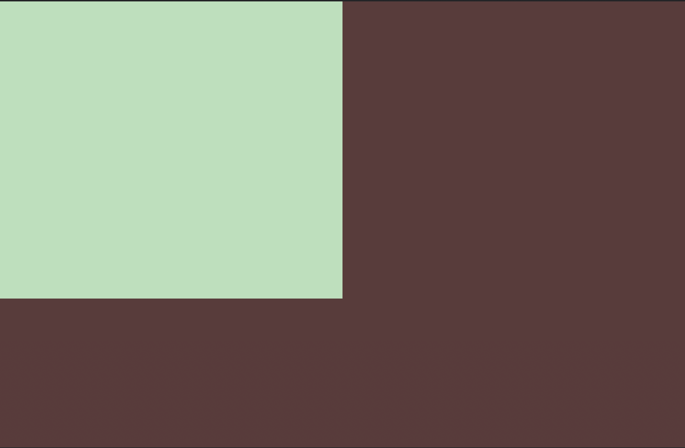

## Simply Square



### HTML

```HTML
<div></div>
<style>
    body {
        --background-color: #5d3a3a;
        --square-color: #b5e0ba;
        background-color: var(--background-color);
        margin: 0;
    }

    div {
        width: 50vw;
        height: 66.67vh;
        background: var(--square-color);
    }
</style>
```
