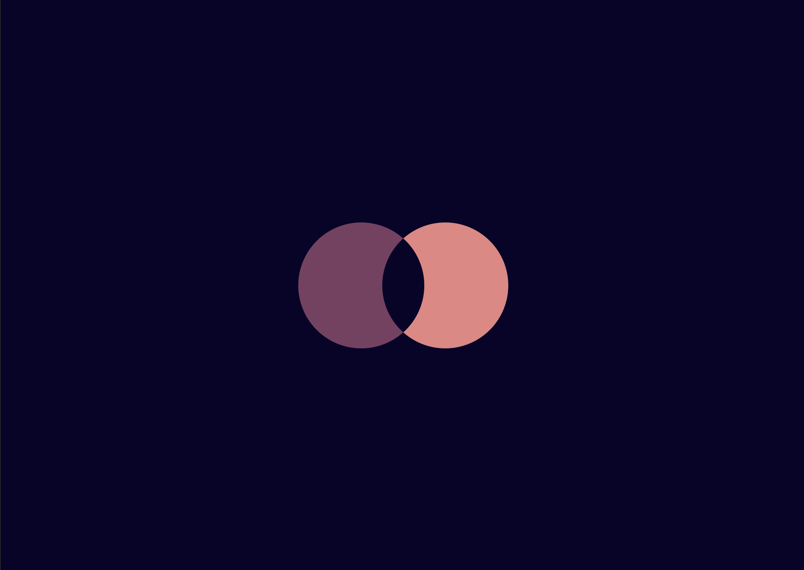

## Overlap



### HTML

```HTML
<div></div>
<style>
      :root {
        --background-color: #09042a;
        --left-circle-color: #7b3f61;
        --right-circle-color: #e78481;
        background: var(--background-color);
      }

      div,
      div::before {
        border-radius: 50%;
        height: 150px;
        position: absolute;
        width: 150px;
      }

      div {
        background: var(--left-circle-color);
        box-shadow: 100px 0 0 0 var(--right-circle-color);
        left: 50%;
        overflow: hidden;
        transform: translate(-125px, -75px);
        top: 50%;
      }

      div::before {
        content: "";
        background: var(--background-color);
        transform: translate(100px);
      }
</style>
```
